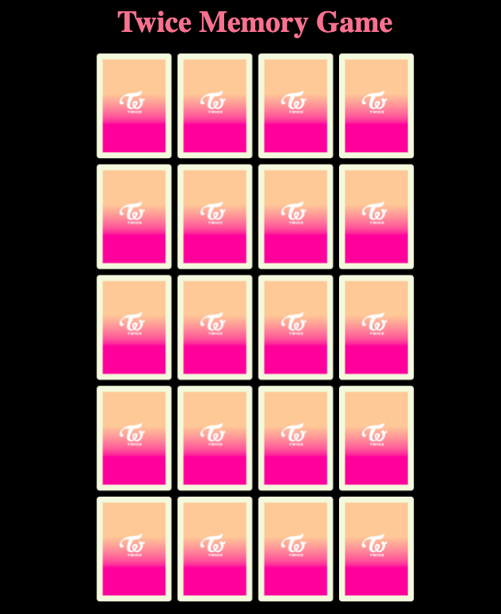

# TWICE Memory Card Game

## Description

This TWICE Memory Card game application was designed specially for my younger brother who is a BIG Twice fan. Twice is a well-known Korean Pop girl group. This was created for anybody else who are also big Twice fans. The way to navigate this game application is very simple and straight forward. 

There are 20 cards on the game board, and the player has to find a total of 10 matching pairs. The user has to click on a pair of cards to see if it matches. If it does not match, the cards will flip back over, and it will repeat the cycle until the user has successfully found a matching pair. The matching pair of cards will stay facing upright, so you can guess where the other matchines pairs would be. There is also a countdown timer, so the pressure is on! 

It is a very fun and interactive game for user and BIG Twice fans to enjoy!

## Screenshot

## GIF

